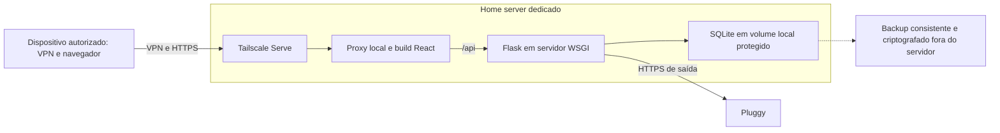

# FinanceHub: análise de segurança e acesso remoto

Data: 05/10/2026. Cenário informado: uso pelo proprietário e sua família, em dispositivos autorizados, com uma conta individual por pessoa e isolamento dos dados financeiros.

## Atualização da primeira etapa — autenticação e isolamento

Após a análise inicial abaixo, foram corrigidas as operações de usuários, a gravação de senha na atualização e a validação de propriedade das conexões Pluggy. Sessões passaram a usar cookies HttpOnly com CSRF, revogação persistente e prazo de oito horas; o cadastro público foi fechado e o administrador passou a criar/recuperar acessos pelo terminal. Foram acrescentados testes com JWT real e dois usuários isolados, usando banco em memória. A implementação e os comandos estão no [README do backend](backend/README.md#cadastro-e-autenticação).

As constatações seguintes registram o estado anterior a essa correção. As recomendações de implantação, VPN, HTTPS, backups, disponibilidade e MFA continuam pendentes. A alteração foi validada em ambiente isolado, sem executar migrações ou sincronização no banco financeiro real; a configuração do home server ainda não foi testada.

## Conclusão

A recomendação para esse cenário é um servidor doméstico dedicado, com acesso exclusivo por uma VPN privada, preferencialmente Tailscale pela facilidade operacional, e HTTPS. Antes de liberar o acesso à família, corrigir as rotas de usuários, fortalecer as sessões e verificar o vínculo das conexões Pluggy com seus proprietários.

O acesso privado pode ser mantido se futuramente a aplicação for movida para uma VPS. Hospedar em casa controla a localização do banco, mas transfere para o administrador as responsabilidades de atualização, recuperação, energia e disponibilidade. A VPN reduz a exposição de rede; não corrige autorização defeituosa na API.

O isolamento proposto protege familiares uns dos outros no uso da aplicação. Não impede o administrador do servidor, alguém com acesso ao sistema operacional ou quem possui a chave dos backups de ler o banco. Privacidade contra o próprio administrador exigiria outro modelo de confiança, instâncias independentes ou criptografia com chaves que ele não controla. Isso também precisaria ser compatível com a integração bancária que processa os dados no servidor.

## Escopo e limites

Foram revisados frontend React/Vite, hooks e serviços, rotas Flask, serviços e repositórios, modelos, configuração, dependências declaradas, testes e documentação. As verificações executadas usaram o frontend local e o backend com banco SQLite em memória e respostas bancárias simuladas.

Não foram consultadas contas bancárias reais, modificados dados financeiros, publicados serviços, alteradas regras do roteador ou lidos os valores de credenciais do arquivo `.env`. A análise não inspeciona o home server, a rede doméstica, o provedor de internet nem a configuração do painel Pluggy. É uma revisão do projeto e de sua preparação operacional, não uma certificação de segurança ou um teste de invasão de uma implantação real.

## O que já funciona como base

- O frontend separa páginas, componentes, hooks, serviços HTTP e utilitários. Não é necessário reescrevê-lo ou criar aplicações nativas para acessar pelo navegador em celulares e computadores.
- O backend organiza rotas, serviços, repositórios e modelos. A preparação para produção pode preservar essas camadas.
- Cadastro e login usam `generate_password_hash` e `check_password_hash`, com a ressalva importante da rota de atualização de usuários descrita abaixo.
- Listagem de contas, transações e categorias usa a identidade do JWT para restringir os dados. A edição pública de transações verifica o proprietário; associações validam todos os envolvidos e são atômicas.
- A sincronização é manual por mês, protege identificadores editados/associados e mantém as credenciais Pluggy no backend.
- Os modelos não serializam hash de senha ou código de verificação. O `.env` do backend e o banco SQLite estão ignorados pelo Git; os arquivos de exemplo estão versionados.
- Há regras de adaptação de layout a telas pequenas. Isso ainda precisa de teste real nos celulares da família, especialmente tabelas e conexão bancária.

## Problemas e prioridades

### 1. Bloqueador: operações de usuários sem autenticação

Em `backend/routes/user_route.py`, `GET /users`, `PATCH /update_users/<user_id>` e `DELETE /delete_users/<user_id>` não exigem JWT. Listar usuários revela nome, e-mail e identificador; atualização e exclusão recebem o identificador no caminho sem validar a identidade de quem faz a requisição.

Qualquer pessoa ou processo que alcance a API pode tentar essas operações. Uma VPN não protege um familiar contra outro usuário já autorizado a entrar na mesma rede.

Correção: remover a listagem geral do acesso comum e oferecer um recurso autenticado para o próprio perfil. Atualização e exclusão devem exigir autenticação, conferir propriedade e pedir reautenticação para operações sensíveis. Cadastro familiar deve ser por convite ou controlado pelo administrador, sem criar um cadastro aberto desnecessário. Não basta esconder botões no frontend.

### 2. Bloqueador: atualização de senha persiste o conteúdo recebido

Em `backend/services/user_service.py`, `update_user` atribui `user.password = password`, enquanto a criação gera um hash. A rota correspondente é justamente uma das rotas sem autenticação.

Uma senha comum enviada ali deixa de seguir o formato esperado no login e pode bloquear o acesso. O campo também aceita um hash fornecido por quem faz a requisição. A combinação exige correção prioritária, não apenas adicionar VPN.

Correção: receber a senha nova, validar a sessão/senha atual conforme a operação, gerar o hash no servidor e invalidar sessões anteriores quando necessário. O atributo `username` utilizado nessa atualização também não corresponde ao campo `name` do modelo atual e precisa ser corrigido.

### 3. Alto: comprovação de propriedade da conexão Pluggy

O token de conexão é criado sem um identificador do usuário nas opções. A sincronização recebe `itemId` do navegador e consulta os dados usando as credenciais da aplicação. O serviço de contas impede reatribuir uma conta já pertencente a outro usuário, o que é uma proteção útil.

Entretanto, não encontrei uma validação do item externo contra o usuário que iniciou a conexão. Isso não demonstra, por si só, que uma pessoa consegue adivinhar um item ou acessar outra conta; demonstra uma etapa de autorização ainda não comprovada no código.

Correção: associar o fluxo de conexão ao usuário autenticado, usar `options.clientUserId` no token conforme a documentação Pluggy e validar, no servidor, o proprietário do item antes de salvar qualquer conta. O identificador enviado pelo cliente e a posse de um UUID não devem substituir essa conferência. Credenciais antigas e itens sem vínculo explícito exigem uma transição cuidadosa, sem atribuição automática a terceiros.

### 4. Alto: sessões, recuperação e tentativas de autenticação

O JWT fica em `localStorage`; o logout o remove do navegador, sem revogação no servidor. Não encontrei limitação de tentativas de login/verificação, MFA na aplicação, validade explícita dos códigos de verificação ou recuperação de conta completa. O código é gerado com `random.randint` e impresso no terminal; isso simula envio de e-mail, não implementa um fluxo de produção.

Não foi identificado um ataque XSS concreto. O armazenamento do token amplia o impacto caso um script indevido consiga executar na origem da aplicação.

Correção recomendada: sessão em cookie `HttpOnly`, `Secure` e com política `SameSite` apropriada, incluindo proteção CSRF nos endpoints que alteram dados; expiracão configurada, revogação de sessão e reautenticação para mudanças de senha/conexão. MFA ou passkeys também podem ser adotados com um provedor de identidade mantido, se desejado. Na VPN, cada familiar deve usar sua própria identidade com MFA.

Para uma família pequena, provisionamento por convite é mais simples que operar cadastro público e verificação de e-mail simulada. Se permanecer a verificação por código, usar geração criptograficamente segura, prazo, limite de tentativas e entrega real.

### 5. Alto: execução atual é de desenvolvimento

`backend/main.py` chama `app.run(debug=True)`. O frontend é documentado para executar com o servidor de desenvolvimento do Vite. Não há uma configuração de produção, proxy HTTPS, gerenciamento de serviço ou implantação reproduzível no repositório revisado.

Correção: servir o build estático do React e executar Flask em servidor WSGI de produção, com debug desativado. Gunicorn é uma opção em Linux; Waitress é uma opção quando o host permanece Windows. A documentação Flask deixa explícito que até uma aplicação privada, usada por uma única pessoa, deve sair do servidor de desenvolvimento quando entra em produção.

As inicializações de tabelas, proteção, coluna de subcategoria e classificação estão dentro do bloco `if __name__ == '__main__'`. Importar `main:app` em um servidor WSGI não executa esse bloco. O processo de implantação precisa de uma etapa explícita de inicialização/migração antes de iniciar o serviço, com backup prévio e sem rodá-la simultaneamente em vários workers.

### 6. Médio: dados e segredos

O banco armazena valores, datas, descrições, titular, CPF/CNPJ, dados bancários e de cartão. O código revisado não implementa criptografia de banco/backup, redução de dados retornados ou uma política operacional de retenção. Isso não comprova que o disco atual seja desprotegido; significa que a implantação deve fornecer essa proteção.

Medidas: disco/volume criptografado, permissões de arquivo restritas ao serviço, backup criptografado fora do servidor e teste de restauração. Guardar somente os campos necessários e evitar devolver ao navegador campos que a tela não utiliza. Segredos devem ficar fora do build React, das imagens e dos logs. Variáveis `VITE_*` entram no frontend e não servem para segredos.

Criptografia de disco protege especialmente mídia desligada/roubada; não protege contra o administrador ou um processo comprometido com acesso ao banco montado. A chave dos backups deve ser guardada separadamente, com um procedimento de recuperação.

### 7. Médio: configuração HTTP e acesso de outros dispositivos

`frontend/src/services/api.js` usa `http://localhost:5000` como padrão. Em um celular, `localhost` é o próprio celular, não o servidor doméstico. Sob HTTPS, uma chamada à API HTTP também pode ser bloqueada pelo navegador.

Correção: publicar frontend e API sob a mesma origem HTTPS. O proxy deve entregar o frontend em `/` e encaminhar `/api/*` para Flask, removendo o prefixo conforme as rotas existentes. Configurar o frontend com `VITE_API_URL=/api` no build. Isso permite usar o mesmo endereço em casa ou fora e simplifica sessão, certificados e CORS.

`CORS(app)` não restringe origens. CORS não substitui autenticação nem é, sozinho, um vazamento de todos os dados protegidos por JWT. Contudo, não deve ficar irrestrito sem necessidade; com uma única origem, pode ser removido ou restrito ao domínio exato.

### 8. Médio: disponibilidade, dependências e consistência

- Autenticação Pluggy e consulta de transações têm timeout; geração de token e consulta de contas ainda não têm timeout explícito. Requisições lentas podem ocupar os workers. Adotar timeouts em todas as chamadas, limites de frequência e uma trava de sincronização por usuário/conta. Se o histórico ou volume crescer, mover sincronização para jobs com status/progresso.
- A API autentica novamente na Pluggy em várias chamadas. A documentação recomenda reutilizar a chave enquanto válida. Um cache seguro no backend reduz chamadas de autenticação e risco de atingir limites.
- A sincronização confirma lançamentos individualmente; uma falha posterior pode deixar trabalho parcial. Precisam existir indicação de falha, recuperação e idempotência, sem contar transações incompletas como uma sincronização inteiramente bem-sucedida.
- Categorias são inicializadas/migradas também em consultas GET. Isso gera escritas em leitura e merece redução, principalmente com vários usuários simultâneos.
- `requirements.txt` não lista `requests`, embora o código importe a biblioteca; não inclui o servidor WSGI escolhido. Os scripts `setup.bat` e `Makefile` ainda contêm caminhos do template. Corrigir a instalação antes de depender de recuperação automática em outro servidor.
- `Float` armazena valores monetários, embora alguns cálculos já usem Decimal/centavos. Uma evolução para centavos inteiros ou Numeric exige migração testada. Não é uma condição para instalar VPN, mas é relevante para integridade financeira.
- Saldo anterior automático é uma estimativa reconciliada com o saldo bancário, especialmente quando faltam meses. Data bancária e competência continuam sendo um assunto separado de segurança e hospedagem.

## Comparação das opções

| Opção | Vantagem principal | Limitação principal | Adequação ao cenário |
|---|---|---|---|
| Home server dedicado + Tailscale | Banco permanece em casa; serviço web fica privado; operação de acesso simples | Energia, conexão e recuperação dependem da casa e do administrador | Recomendação inicial, se o servidor já existe e será mantido |
| VPS + Tailscale | Acesso privado sem depender de energia/internet da casa | Custo recorrente, dados hospedados por terceiro e manutenção do sistema continuam | Melhor alternativa se disponibilidade for mais importante que manter o banco em casa |
| Home server + WireGuard administrado diretamente | Maior autonomia sobre a VPN | Chaves, endpoint acessível, NAT/CGNAT e recuperação ficam a seu cargo | Bom se o administrador conhece redes e quer evitar o serviço de coordenação do Tailscale |
| Cloudflare Tunnel + Access | Acesso por navegador pode dispensar cliente VPN, com política de identidade | Outra fronteira de confiança; proteção de origem e de dispositivo precisam ser configuradas; não corrige a aplicação | Alternativa se houver uma necessidade real de acesso sem cliente VPN |
| Site/API públicos protegidos apenas pelo login atual | Acesso fácil | Código atual tem bloqueadores; exposição de rede muito maior | Não recomendado |

Hospedagem gerenciada pode reduzir tarefas do sistema operacional, mas exige avaliar armazenamento persistente, integração Pluggy, sessões, backups e isolamento. Dividir frontend e backend entre vários provedores agora acrescentaria origens e configuração sem resolver os principais riscos.

## Arquitetura recomendada

Sugestão operacional: Linux estável em máquina/VM dedicada, Tailscale no host e aplicação em serviços ou containers com volumes persistentes. Docker Compose facilita a reprodução da instalação, mas não é obrigatório e não é uma proteção suficiente sozinho. Containers devem executar sem privilégios, sem Docker socket montado e sem exposição desnecessária de portas.

Tailscale Serve fornece HTTPS à rede privada e encaminha ao proxy local. Usar Serve privado e conferir que Funnel não esteja publicado. Não abrir as portas web 5000, 5173 ou a porta do proxy na internet. Não publicar o arquivo do banco, `.env`, diretório do repositório ou painel de administração.

Se usar containers, publicar somente o proxy em loopback do host e manter API/banco na rede interna. Testar as interfaces realmente expostas; uma configuração de firewall genérica não basta para provar que portas de containers estão privadas.

## Política de acesso familiar

1. Uma identidade VPN e uma conta FinanceHub por familiar. Não compartilhar tokens, senhas ou a conta do administrador.
2. Ativar MFA no provedor de identidade da VPN e aprovação explícita de dispositivos. Bloqueio de tela, atualizações e criptografia também nos celulares/notebooks.
3. Remover a permissão inicial ampla da rede privada e conceder à família apenas acesso HTTPS ao serviço. Não dar acesso ao SSH, ao sistema de arquivos, ao banco, a outras máquinas domésticas ou ao painel de administração.
4. Separar o administrador dos usuários comuns. O administrador de infraestrutura não precisa ter uma tela que liste as finanças de todos.
5. Na API, todas as consultas e alterações usam a identidade autenticada, não um `user_id` enviado pelo navegador. Validar o vínculo de transações, categorias, subcategorias, contas e itens bancários.
6. Revogar dispositivo perdido e sessões da aplicação. Se o incidente envolver segredo Pluggy ou chave JWT, aplicar rotação conforme o escopo.
7. Testar acesso negado por IP/ID de outro familiar, inclusive consultas diretas à API e conexões bancárias. Verificar compartilhamento de navegador e encerramento de sessão.

Uma VPN de rede não garante o isolamento de registros no banco. O login e a autorização da aplicação continuam necessários. Também não se deve confiar em headers de identidade do proxy se houver uma rota alternativa que permita chegar diretamente à API.

## Banco de dados, backups e disponibilidade

SQLite é uma escolha razoável inicialmente para poucas pessoas em um servidor, com acesso ao banco exclusivamente pelo backend. Não é necessário migrar para PostgreSQL apenas para acessar remotamente. O arquivo deve ficar em disco/volume local persistente, fora da pasta pública e fora de sincronizadores de arquivos ou compartilhamentos de rede.

Configurar concorrência e ocupação de escrita com cuidado; sincronizações simultâneas são o principal candidato a contenção. PostgreSQL passa a fazer sentido se houver escritas concorrentes frequentes, processos separados de sincronização, múltiplas instâncias da API ou requisitos operacionais maiores. Não implementa isolamento por usuário automaticamente; as políticas da aplicação ainda são essenciais.

Backup recomendado: execução diária e antes de implantação/migração; retenção definida; cópia externa criptografada com credenciais diferentes. Usar o mecanismo de backup consistente do SQLite ou interromper escritas, em vez de copiar arbitrariamente um banco ativo. Preservar também proteções de sincronização e catálogo de categorias. Restaurar em ambiente separado periodicamente. Espelhamento de discos e snapshot na mesma máquina não cobrem roubo, exclusão ou comprometimento completo.

O home server precisa permanecer ligado, com reinício automático dos serviços, monitoramento de espaço/disco e alertas úteis. UPS/nobreak ajuda quando disponibilidade importa, mas não substitui backup. Criptografia que exige desbloqueio manual precisa de uma estratégia de reinício compatível com o uso remoto. Se indisponibilidade doméstica for inaceitável, preferir a VPS privada desde o início.

## Integração bancária com o serviço privado

O fluxo revisado consulta a Pluggy a partir do backend e recebe sucesso do widget no navegador. Não há receptor de webhook implementado; portanto, não há necessidade demonstrada de expor toda a API publicamente para receber eventos bancários.

O navegador precisa de internet para abrir o widget e concluir autenticações bancárias. Testar o domínio HTTPS escolhido e os retornos OAuth nos dispositivos reais, confirmando URLs permitidas/retorno nas configurações da integração. Não presumir que todos os conectores aceitam automaticamente um domínio privado.

Se houver webhooks no futuro, projetar um receptor pequeno e separado, com validação de autenticidade e processamento restrito. Não publicar a aplicação inteira só para receber esses eventos.

## Plano de execução e critérios de aceite

**Etapa 1 — corrigir acesso e contas.** Remover/proteger as rotas de usuários; corrigir hashing; restringir cadastro; criar testes com JWT real para autenticação, expiração, propriedade e operações sensíveis; garantir vínculo Pluggy. Nenhuma credencial da família deve depender de uma rota aberta.

**Etapa 2 — preparar produção.** Definir segredo JWT forte, sessões, HTTPS/origem única, build do frontend, WSGI sem debug, inicialização/migrações explícitas, dependências completas, volumes e backup. Subir primeiro usando dados fictícios.

**Etapa 3 — liberar VPN.** Configurar identidades individuais, MFA, aprovação de dispositivos e acesso mínimo. Validar que um aparelho fora da rede privada não alcança o serviço; um usuário comum não alcança administração nem finanças de outro.

**Etapa 4 — testar operação.** Duas contas fictícias com conjuntos financeiros diferentes; conexão real controlada depois; teste em celular por rede móvel; sincronizações, edição, associação, isolamento de categorias e logout. Simular reinício e restaurar backup antes de depender da instalação.

**Etapa 5 — operação contínua.** Atualizações planejadas, avisos de falha, revisão de dispositivos e privilégios, auditoria mínima de login/conexão/edição/associação sem registrar payload financeiro completo. Quando houver necessidade comprovada, adotar jobs e PostgreSQL.

## Verificações executadas

- 52 testes do backend passaram com SQLite em memória e integração externa simulada.
- 25 testes do frontend passaram; lint e build de produção concluíram.
- Ruff do backend passou; 26 arquivos passaram na verificação de formatação.
- `npm audit --omit=dev` não apontou vulnerabilidades conhecidas nas dependências de produção do frontend no momento da consulta. Isso não garante ausência de vulnerabilidades no código, no backend, nas dependências de desenvolvimento ou na implantação.
- As rotas foram inventariadas por inspeção sintática. As rotas de usuários citadas não possuem autenticação no código revisado.
- Os testes de backend substituem o decorador JWT e a identidade para testar funcionalidades isoladas. Eles cobrem várias regras de propriedade, mas não validam autenticação criptográfica, expiração, revogação ou resistência a abuso reais. Essa lacuna precisa de testes adicionais.
- Não foi executada uma auditoria online completa das dependências Python; não atribuo ao backend um resultado de ausência de vulnerabilidades conhecidas.

## Fontes primárias consultadas

- [Flask: implantação em produção](https://flask.palletsprojects.com/en/stable/deploying/).
- [OWASP: autorização](https://cheatsheetseries.owasp.org/cheatsheets/Authorization_Cheat_Sheet.html).
- [OWASP: gerenciamento de sessão](https://cheatsheetseries.owasp.org/cheatsheets/Session_Management_Cheat_Sheet.html).
- [Tailscale Serve: HTTPS e acesso privado](https://tailscale.com/docs/features/tailscale-serve).
- [Tailscale: segurança, criptografia e metadados](https://tailscale.com/security).
- [Tailscale: política inicial e exemplos de acesso](https://tailscale.com/docs/reference/examples/acls).
- [Tailscale: aprovação de dispositivos](https://tailscale.com/docs/features/access-control/device-management/device-approval).
- [Tailscale: planos atuais](https://tailscale.com/pricing).
- [WireGuard: configuração e conectividade](https://www.wireguard.com/quickstart/).
- [Cloudflare: aplicação com Tunnel e Access](https://developers.cloudflare.com/cloudflare-one/access-controls/applications/http-apps/self-hosted-public-app/).
- [SQLite: usos adequados e limites de concorrência](https://www.sqlite.org/whentouse.html).
- [SQLite: backup online consistente](https://www.sqlite.org/backup.html).
- [Pluggy: autenticação, escopo e clientUserId](https://v2.docs.pluggy.ai/en/reference/authentication).

Valores, limites de planos e comportamento de serviços podem mudar. As recomendações de infraestrutura são inferências para o cenário familiar informado; as falhas de código descritas são observações sobre a revisão atual do repositório.
