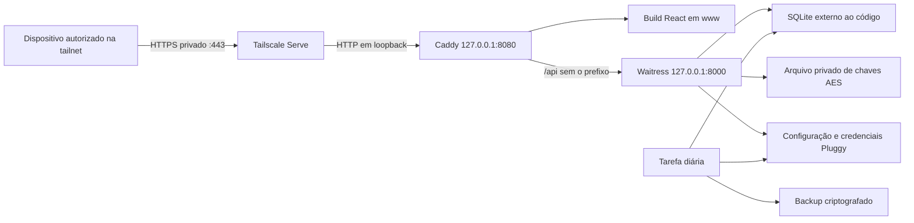

# Produção em home server

Este guia prepara **Windows primeiro**, com migração posterior para Linux sem Docker e, depois, contêineres. A aplicação mantém Flask, React e SQLite; a camada de execução fica em `deploy/`, e o estado persistente fica fora do código. Os comandos abaixo devem ser executados no home server, com caminhos e hostname reais.

## Arquitetura



O Tailscale Serve termina TLS e disponibiliza a aplicação somente aos dispositivos autorizados da tailnet. O Caddy atende o build, permite recarregar rotas do React e encaminha `/api` para a API. Ambos os servidores internos escutam apenas em `127.0.0.1`. O navegador usa uma única origem HTTPS, com cookies `Secure`, `HttpOnly`, proteção CSRF e o login individual da aplicação. A autorização do Tailscale controla o acesso à rede; a autorização do backend continua controlando os dados de cada usuário. [Documentação do Serve](https://tailscale.com/docs/features/tailscale-serve).

Esta configuração usa **Serve privado**, sem publicar a aplicação com Funnel e sem encaminhar as portas internas no roteador. O Caddy está com HTTPS automático desativado porque o certificado pertence ao Tailscale. HTTP em loopback permanece dentro do próprio servidor. O endereço normal de acesso será `https://<servidor>.<tailnet>.ts.net`, sem `:8000` ou `:8080`.

| Componente | Responsabilidade operacional |
|---|---|
| `backend/server.py` | Servidor WSGI Waitress; recusa iniciar sem configuração de produção, banco preparado e dados financeiros verificáveis. |
| `deploy/Caddyfile` | Build estático, fallback do React, proxy da API e cabeçalhos HTTP. |
| `deploy/prepare_state.py` | Instalação nova ou cópia consistente do estado existente para uma pasta nova. |
| `deploy/run_backup.py` | Backup, verificação, retenção, cópia externa opcional e registro de sucesso/falha. |
| `deploy/windows/Install-Services.ps1` | Gera e valida serviços; com `-Install`, registra serviços Windows e tarefa diária. |
| `deploy/windows/Invoke-Backend.ps1` | Inicialização, verificações e comandos administrativos usando a configuração externa. |
| `deploy/linux/` | Templates systemd para a etapa futura em Linux. |

## Código e estado separados

Exemplo de layout Windows:

```text
C:\FinanceHub\app\                       checkout dedicado da aplicação
  .venv\                                runtime Python da aplicação
C:\FinanceHub\tools\                     executáveis oficiais usados na instalação
C:\ProgramData\FinanceHub\state\          estado persistente, fora do checkout
  config\app.env                         JWT, caminhos e credenciais Pluggy por usuário
  keys\financial-data-keys.json           chave ativa e chaves anteriores dos dados
  data\financehub.db                     banco e eventuais arquivos auxiliares SQLite
  backups\                               arquivos scheduled-*.fhbackup
  logs\                                  logs operacionais e backup-status.json
  services\                              WinSW, XML e executável Caddy
  www\                                   somente o build do frontend
```

`config`, `keys`, `data` e `backups` não devem ser publicados como arquivos estáticos, enviados ao Git ou colocados dentro de `www`. O `.env` continua sendo um arquivo no formato dotenv; em produção, seu nome é `app.env`, selecionado por `FINANCEHUB_ENV_FILE`. Os comandos administrativos atualizam ali as credenciais Pluggy individuais, com trava e substituição atômica. Não cadastre segredos em variáveis `VITE_*`: elas entram no JavaScript entregue ao navegador.

A chave financeira é independente da chave JWT e das credenciais Pluggy. Preserve o arquivo de chaves completo ao reutilizar dados ou backups. O backup periódico inclui banco e configuração **dentro do envelope criptografado**, mas não inclui o arquivo de chaves. Mantenha uma cópia protegida dessas chaves em outro meio, separada dos backups; perder todas as cópias impede recuperar os dados. O administrador do servidor, que possui a chave, continua capaz de decifrá-los.

## Instalação Windows

### 1. Preparar o servidor e o endereço

Use uma instalação Windows atualizada, armazenamento local confiável para SQLite e uma conta administrativa para manutenção. Reserve um checkout dedicado ao servidor: evite instalar os serviços sobre o ambiente de desenvolvimento de uso diário. Use BitLocker no volume dos dados e mantenha sua recuperação em local seguro. Evite suspensão automática enquanto o home server precisar atender requisições.

Instale Python 3.11 ou superior **para todos os usuários da máquina**, em um caminho acessível às contas de serviço, com suporte a `sqlite3.Connection.serialize()` e `deserialize()`. Evite usar o Python instalado apenas dentro do perfil do administrador: a `.venv` continua dependendo daquele runtime. Para compilar o frontend, use Node.js com npm compatível com `package-lock.json` (Node 22.12 ou superior é uma opção compatível). O Node é necessário no build, não no serviço que atende os usuários.

Instale o [Tailscale para Windows](https://tailscale.com/download/windows), autentique o servidor e identifique seu hostname DNS completo com `tailscale status --json` ou pelo painel da tailnet. Configure execução sem depender de uma sessão de usuário, conforme [Run unattended](https://tailscale.com/docs/features/run-unattended). Habilite HTTPS na tailnet quando solicitado pelo Serve. Restrinja o acesso a esse servidor aos usuários/dispositivos da família, com aprovação de dispositivos e autenticação forte no provedor de identidade. Cada familiar também terá sua própria conta FinanceHub.

Baixe Caddy e WinSW de suas fontes oficiais, com a arquitetura correta para o servidor. Para WinSW, a base deste instalador é a versão estável **2.12.0**, usando `WinSW-x64.exe` no Windows x64. O Caddyfile foi validado com **Caddy 2.11.7**; use essa versão ou valide uma atualização compatível antes de instalar. Confira checksums publicados quando disponíveis, com o algoritmo informado pelo próprio arquivo de checksums; registre a versão e o hash dos executáveis usados para tornar atualizações rastreáveis. [Caddy: instalação](https://caddyserver.com/docs/install); [WinSW 2.12.0](https://github.com/winsw/winsw/releases/tag/v2.12.0).

Abra PowerShell no checkout. Os exemplos usam estas variáveis; ajuste-as uma vez para o seu servidor:

```powershell
$ErrorActionPreference = 'Stop'
$Project = 'C:\FinanceHub\app'
$State = 'C:\ProgramData\FinanceHub\state'
$AppHost = 'servidor.sua-tailnet.ts.net' # Substituir pelo hostname real, sem https://.
$Origin = 'https://' + $AppHost
$WinSW = 'C:\FinanceHub\tools\WinSW-x64.exe'
$Caddy = 'C:\FinanceHub\tools\caddy.exe'
$ExternalBackups = 'E:\FinanceHubBackups' # Pasta existente em outro meio de armazenamento.
Set-Location -LiteralPath $Project
```

Quando `FINANCEHUB_ENV_FILE` é informado, as variáveis presentes nesse arquivo têm precedência sobre valores herdados do terminal. Use uma sessão de manutenção própria e confira o arquivo escolhido para evitar misturar instalações. Se a política local impedir scripts PowerShell, revise a origem dos scripts e use uma política permitida pela administração do servidor, limitada à sessão; o guia não exige alterar permanentemente a política de toda a máquina.

### 2. Instalar o runtime

Na raiz do checkout:

```powershell
python -m venv .venv
& "$Project\.venv\Scripts\python.exe" -m pip install -r backend\requirements-production.txt
if ($LASTEXITCODE -ne 0) { throw 'Instalação das dependências falhou.' }
```

O arquivo de produção instala os componentes necessários à API e ao Waitress, usando as versões do projeto como restrições. Não é necessário manter o servidor de desenvolvimento Flask em execução. O [Flask documenta Waitress](https://flask.palletsprojects.com/en/stable/deploying/waitress/) como opção de servidor WSGI com suporte direto a Windows.

### 3. Preparar o estado: escolher uma das alternativas

**Preservar os usuários, contas e transações atuais:** pare a API de origem e qualquer outro processo que escreva no banco ou altere as credenciais. Identifique o banco configurado naquela instalação; não presuma seu nome apenas pela pasta. O banco já deve ter passado pela [migração da criptografia](../backend/README.md#migração-offline-e-verificação). Informe o `.env`, o SQLite e o arquivo de chaves dessa mesma instalação:

```powershell
$Prepare = @(
    '-B', "$Project\deploy\prepare_state.py",
    '--state-dir', $State,
    '--origin', $Origin,
    '--source-env', 'D:\FinanceHub-origem\backend\.env',
    '--source-key', 'D:\FinanceHub-origem\backend\.secrets\financial-data-keys.json',
    '--source-database', 'D:\FinanceHub-origem\backend\instance\financehub.db'
)
& "$Project\.venv\Scripts\python.exe" @Prepare
if ($LASTEXITCODE -ne 0) { throw 'Preparação do estado falhou.' }
```

Os caminhos `D:\FinanceHub-origem\...` são exemplos; substitua-os pelas fontes reais. O comando usa um snapshot SQLite consistente, preserva os dados e a chave AES e cria uma chave JWT nova para produção. Os usuários precisarão entrar novamente. A origem não é alterada. Preserve-a até verificar a nova instalação e uma restauração de teste.

**Instalação nova, sem aproveitar usuários ou dados:** use apenas `--fresh`:

```powershell
& "$Project\.venv\Scripts\python.exe" -B "$Project\deploy\prepare_state.py" --state-dir $State --origin $Origin --fresh
if ($LASTEXITCODE -ne 0) { throw 'Preparação do estado falhou.' }
```

As duas alternativas exigem uma pasta de estado que **ainda não exista**. O comando nunca sobrescreve uma instalação. Se houver falha com saída parcial, confira os arquivos gerados e escolha outra pasta nova; não apague a origem ou as chaves para repetir. Não use `--fresh` para substituir uma instalação que tem dados.

### 4. Compilar e publicar o frontend

```powershell
Set-Location -LiteralPath "$Project\frontend"
$env:VITE_API_URL = '/api'
npm.cmd ci
if ($LASTEXITCODE -ne 0) { throw 'Instalação do frontend falhou.' }
npm.cmd run build
if ($LASTEXITCODE -ne 0) { throw 'Build do frontend falhou.' }
Get-ChildItem -LiteralPath "$Project\frontend\dist" -Force | Copy-Item -Destination "$State\www" -Recurse
Set-Location -LiteralPath $Project
```

Na primeira instalação, `www` está vazia. Copie somente `dist`; fontes, `.env`, banco, chaves e `node_modules` não fazem parte da publicação. Atualizações devem gerar um build novo e seguir o procedimento de manutenção abaixo. `npm run dev` e `npm run preview` não são serviços de produção. [Vite: publicação do build](https://vite.dev/guide/static-deploy.html).

### 5. Inicializar e conferir antes de registrar serviços

```powershell
& "$Project\deploy\windows\Invoke-Backend.ps1" -ProjectPath $Project -StatePath $State -Operation Initialize
```

Esse comando aplica `init-db` e `verify-encrypted-data`. Ele cria tabelas ausentes e aplica as migrações incrementais já existentes, mas não converte silenciosamente um banco financeiro antigo em claro. Para uma instalação nova, crie o primeiro acesso pelo comando administrativo da seção seguinte.

Prepare e valide o XML dos serviços e o Caddyfile **sem** registrar serviços:

```powershell
$ServiceOptions = @{
    ProjectPath = $Project
    StatePath = $State
    AppHost = $AppHost
    WinSWPath = $WinSW
    CaddyPath = $Caddy
    ExternalBackupPath = $ExternalBackups
}
& "$Project\deploy\windows\Install-Services.ps1" @ServiceOptions
```

Confira os XMLs em `state\services\Api` e `state\services\Web`: caminhos, hostname, contas de serviço, logs e executáveis. Sem `-Install`, a geração não registra serviços ou tarefa. O `AppHost` deve corresponder exatamente ao hostname da origem HTTPS usada na preparação.

### 6. Instalar e iniciar automaticamente

No **PowerShell elevado do home server**, reutilize as variáveis e opções anteriores:

```powershell
& "$Project\deploy\windows\Install-Services.ps1" @ServiceOptions -Install
```

O instalador registra `FinanceHubApi` e `FinanceHubWeb` com início automático e reinício em falha. Cada serviço usa sua conta virtual própria, sem senha de usuário. Aplica as permissões necessárias para a API acessar dados/configuração, e para o serviço web ler apenas os arquivos estáticos e sua configuração operacional. A API precisa escrever na pasta `config`, pois as credenciais Pluggy são atualizadas de forma atômica; o arquivo de chaves financeiras permanece somente para leitura pelo serviço.

Também registra a tarefa `FinanceHubBackup`, executada como `SYSTEM` diariamente às **03:00 no horário do servidor**, com execução após indisponibilidade, prevenção de sobreposição, tentativas em falha e limite de uma hora. Faz um backup inicial e só inicia os serviços depois de sua verificação. A pasta externa é opcional; se informada, deve existir e estar disponível. Para outro disco, rede ou NAS, confirme o acesso pela identidade da tarefa, não apenas pelo usuário que abriu o terminal. `SYSTEM` pode não ter acesso a uma pasta de rede ou unidade mapeada da sessão.

Essa etapa altera serviços, ACLs e agendamento da máquina. Execute-a somente no servidor definido para produção. Se houver instalação parcial ou um serviço já registrado, corrija o estado com os serviços parados; o instalador não é um comando de atualização nem deve ser repetido indefinidamente sobre uma instalação existente.

Valide também a execução pela identidade `SYSTEM`, pois o backup inicial do instalador usa a conta administrativa. Inicie a tarefa, aguarde o fim da execução e confira `LastTaskResult=0` e um `checked_at` novo no arquivo de status:

```powershell
Start-ScheduledTask -TaskName FinanceHubBackup
Get-ScheduledTask -TaskName FinanceHubBackup | Select-Object State
Get-ScheduledTaskInfo -TaskName FinanceHubBackup | Select-Object LastRunTime,LastTaskResult
Get-Content -LiteralPath "$State\logs\backup-status.json"
```

### 7. Ativar HTTPS privado e validar

Com os serviços iniciados, no servidor:

```powershell
tailscale serve --bg http://127.0.0.1:8080
tailscale serve status
```

Siga o consentimento de HTTPS da tailnet, se solicitado. `--bg` mantém a configuração em segundo plano; confirme também o funcionamento depois de reiniciar o servidor. O hostname informado pelo Serve deve ser o mesmo de `$AppHost`. Não use `tailscale funnel` para essa instalação privada. [Referência do comando Serve](https://tailscale.com/docs/reference/tailscale-cli/serve).

De um dispositivo autorizado e conectado ao Tailscale, abra `$Origin` e confira:

1. O navegador aceita o certificado HTTPS e a URL é a origem configurada.
2. Login, recarga de uma rota interna, logout e sincronização mensal funcionam.
3. Cada familiar vê somente suas próprias contas e transações.
4. `https://<hostname>/api/healthz` retorna `{"status":"ok"}` sem dados financeiros.
5. Após reiniciar o home server, serviços, Serve e acesso remoto continuam funcionando.

Nos testes locais do proxy, inclua o hostname esperado, pois o Caddy rejeita outros hosts:

```powershell
Invoke-RestMethod -Uri 'http://127.0.0.1:8080/api/healthz' -Headers @{ Host = $AppHost }
Get-Service -Name FinanceHubApi,FinanceHubWeb
Get-NetTCPConnection -State Listen -LocalPort 8000,8080 | Select-Object LocalAddress,LocalPort
```

As portas internas devem aparecer em `127.0.0.1`. Um dispositivo fora das permissões da tailnet não deve conseguir abrir o site. A resposta de saúde verifica disponibilidade do banco; ela não substitui o teste de login, o isolamento ou a verificação dos backups.

## Administrar usuários e credenciais

Execute em PowerShell administrativo usando o estado de produção:

```powershell
& "$Project\deploy\windows\Invoke-Backend.ps1" -ProjectPath $Project -StatePath $State -Operation Admin -AdminArguments @('create-user')
& "$Project\deploy\windows\Invoke-Backend.ps1" -ProjectPath $Project -StatePath $State -Operation Admin -AdminArguments @('reset-password')
& "$Project\deploy\windows\Invoke-Backend.ps1" -ProjectPath $Project -StatePath $State -Operation Admin -AdminArguments @('configure-pluggy','--email','pessoa@exemplo.com')
```

Escolha o comando adequado; não execute os três sem necessidade. Senhas e Client ID/Client Secret são solicitados com entrada oculta. Não os passe como argumentos nem cole o conteúdo de `app.env` em logs, issues ou mensagens. A alteração de credenciais é lida dinamicamente; outras mudanças de configuração, como origem, JWT ou caminhos, exigem reiniciar a API. Recuperar a senha revoga as sessões daquele usuário.

## Backups, retenção e acompanhamento

O backup usa a API de snapshot SQLite, valida a integridade e os payloads financeiros e criptografa **banco completo e arquivo de configuração juntos** antes de gravar. Uma trava na configuração evita capturar o banco e as credenciais em pontos diferentes de uma operação administrativa. Depois de escrever, a rotina decifra e verifica o arquivo; só então o confirma e aplica retenção. Backups periódicos exigem banco SQLite em arquivo já migrado. A implementação usa memória e limita o banco a **512 MiB**; reserve memória para várias representações do snapshot. Bancos maiores exigem revisar essa rotina antes de crescer.

São mantidos os **30 arquivos mais recentes** locais e, quando a cópia externa é configurada, os **90 mais recentes** externos. A retenção conta arquivos, não dias: backups manuais adicionais também entram na contagem. Somente arquivos da rotina com nome completo `scheduled-...fhbackup` são considerados para retenção; os backups de migração e outros arquivos não são removidos. A cópia externa tem sua integridade verificada por SHA-256. Reserve uma pasta externa dedicada a esta instalação.

Para executar manualmente a mesma rotina do agendamento:

```powershell
& "$Project\.venv\Scripts\python.exe" -B "$Project\deploy\run_backup.py" --state-dir $State --external-directory $ExternalBackups
if ($LASTEXITCODE -ne 0) { throw 'Backup ou cópia externa falhou.' }
```

Omita `--external-directory` apenas quando quiser um backup exclusivamente local. A tarefa diária continuará com o destino que foi registrado na instalação; alterar a variável do terminal não altera a tarefa.

Verifique regularmente o agendamento e a recuperação do último backup:

```powershell
Get-ScheduledTask -TaskName FinanceHubBackup | Select-Object TaskName,State
Get-ScheduledTaskInfo -TaskName FinanceHubBackup | Select-Object LastRunTime,LastTaskResult,NextRunTime
Get-Content -LiteralPath "$State\logs\backup-status.json"
& "$Project\deploy\windows\Invoke-Backend.ps1" -ProjectPath $Project -StatePath $State -Operation VerifyBackup
```

`LastTaskResult=0` indica sucesso da última execução; `backup-status.json` informa horário e resultado da rotina. `VerifyBackup` exige um arquivo recuperável com idade de até 26 horas, conferindo também a data autenticada dentro do conteúdo criptografado: renomear um backup antigo não o torna recente. Confira também se `checked_at` é recente: um arquivo de status antigo não comprova que a tarefa continua executando. Essa etapa não envia alertas automaticamente; acompanhe as falhas ou integre futuramente essas verificações ao monitoramento do servidor. Logs dos serviços ficam em `logs\Api` e `logs\Web`, com rotação por tamanho.

Um backup no mesmo disco ajuda contra erros operacionais, mas não contra perda daquele disco. Use outro meio de armazenamento para a cópia externa e mantenha uma cópia das chaves separada e protegida. Teste uma restauração mensalmente e depois de mudanças relevantes na aplicação ou no armazenamento. Não sincronize um SQLite aberto copiando apenas o `.db`: utilize os snapshots desta rotina para evitar perder dados que ainda estejam no WAL.

## Restauração de teste ou recuperação

O formato periódico é diferente do backup de migração `before-encryption-...fhbackup`. Use `restore-production-backup` para arquivos `scheduled-...fhbackup`; o comando antigo `restore-encrypted-backup` continua específico da migração.

Com o runtime preparado e o **arquivo completo de chaves original disponível**, selecione o arquivo explicitamente e restaure para uma pasta que ainda não exista:

```powershell
$Backup = 'E:\FinanceHubBackups\scheduled-SUBSTITUIR_PELO_NOME_REAL.fhbackup'
$Recovered = 'C:\ProgramData\FinanceHub\recovery-test-20261006'
$env:FINANCEHUB_ENV_FILE = "$State\config\app.env"
Set-Location -LiteralPath "$Project\backend"
& "$Project\.venv\Scripts\python.exe" -B -m flask --app main restore-production-backup --backup $Backup --output-dir $Recovered
if ($LASTEXITCODE -ne 0) { throw 'Restauração falhou.' }
```

Em recuperação após perda do servidor, prepare uma configuração privada temporária apontando para a cópia preservada das chaves antes de importar `main`; ela deve cumprir as exigências de produção. O comando não requer que o banco original ainda exista. Não gere uma chave AES nova para tentar decifrar backups antigos.

O resultado contém `financehub.db` e `app.env`. Todas as sessões salvas no snapshot ficam revogadas. O banco atual e o arquivo de chaves não são substituídos. **O `app.env` recuperado ainda contém os caminhos da instalação de origem**; não o use diretamente em outra pasta ou máquina.

Para preparar um estado completo de recuperação com caminhos novos, aproveite os arquivos recuperados como fontes de `prepare_state.py`:

```powershell
$RecoveredState = 'C:\ProgramData\FinanceHub\recovered-state-20261006'
$PrepareRecovery = @(
    '-B', "$Project\deploy\prepare_state.py",
    '--state-dir', $RecoveredState,
    '--origin', $Origin,
    '--source-env', "$Recovered\app.env",
    '--source-key', "$State\keys\financial-data-keys.json",
    '--source-database', "$Recovered\financehub.db"
)
& "$Project\.venv\Scripts\python.exe" @PrepareRecovery
if ($LASTEXITCODE -ne 0) { throw 'Preparação da recuperação falhou.' }
& "$Project\deploy\windows\Invoke-Backend.ps1" -ProjectPath $Project -StatePath $RecoveredState -Operation Initialize
```

Se as chaves estiverem em outro local seguro, ajuste `--source-key` para aquela cópia. A preparação preserva AES, reescreve os caminhos e gera JWT novo. Confira usuários, contas, transações e acesso antes de adotar o estado recuperado. Em um teste, mantenha esse ambiente isolado; não sincronize conexões reais automaticamente. Para adotar a recuperação, pare os serviços e a tarefa existentes, revise os XMLs/caminhos e o agendamento para o estado novo, aplique as ACLs correspondentes e só então inicie. O instalador de primeira instalação não substitui serviços existentes.

## Atualizações e retorno à versão anterior

Prepare a versão nova e seu build antes da janela de manutenção. A branch `v2.0.0` preserva a versão anterior à preparação de produção; não use checkout de uma versão antiga sobre o serviço em execução.

1. Faça e verifique um backup novo, incluindo cópia externa quando configurada. Preserve as chaves, a versão do código e os hashes dos executáveis atuais.
2. Desabilite temporariamente `FinanceHubBackup` e confirme que nenhuma execução está em andamento. Pare `FinanceHubWeb` e depois `FinanceHubApi`.
3. Atualize o checkout dedicado para a revisão escolhida; instale as dependências de produção e gere um build novo. Não copie configurações de desenvolvimento sobre o estado de produção.
4. Publique o build com o serviço web parado, preservando uma cópia do build anterior fora de `www`. Remova arquivos obsoletos somente após conferir que o destino é a pasta estática correta.
5. Execute `Invoke-Backend.ps1 -Operation Initialize` e confira quaisquer instruções de migração da versão. Ao atualizar Caddy/WinSW, revise e valide as configurações antes de trocar os executáveis com os serviços parados.
6. Confira as permissões do código/arquivos novos para as contas de serviço, inicie API e Web, teste saúde, login, recarga e isolamento. Faça um novo backup verificado e reabilite a tarefa.

Comandos de controle:

```powershell
Disable-ScheduledTask -TaskName FinanceHubBackup
Stop-Service -Name FinanceHubWeb
Stop-Service -Name FinanceHubApi
# Aplicar a atualização e as verificações descritas acima.
Start-Service -Name FinanceHubApi
Start-Service -Name FinanceHubWeb
Enable-ScheduledTask -TaskName FinanceHubBackup
```

Voltar somente o código é adequado apenas quando ele continua compatível com o banco. Se uma migração tornou o estado incompatível, recupere o backup anterior em outra pasta e use a versão correspondente; não desfaça tabelas manualmente. Registros criados depois daquele backup precisam ser considerados antes de adotar uma recuperação anterior.

## Verificações antes de publicar uma versão

Em um ambiente de desenvolvimento separado, instale também `backend/requirements-dev.txt` e execute o lint e os testes. A suíte usa arquivos temporários e registros fictícios. Para incluir o teste real do proxy, informe um executável oficial do Caddy; sem essa variável, somente os três testes opcionais do proxy são ignorados.

```powershell
Set-Location -LiteralPath $Project
& "$Project\.venv\Scripts\python.exe" -m ruff check backend
& "$Project\.venv\Scripts\python.exe" -m ruff format --check backend
& "$Project\.venv\Scripts\python.exe" -m ruff check --config backend/pyproject.toml deploy
& "$Project\.venv\Scripts\python.exe" -m ruff format --check --config backend/pyproject.toml deploy
$env:FINANCEHUB_TEST_CADDY = $Caddy
Set-Location -LiteralPath "$Project\backend"
& "$Project\.venv\Scripts\python.exe" -B -m unittest discover -s tests
Set-Location -LiteralPath "$Project\frontend"
npm.cmd run lint
npm.cmd test
npm.cmd run build
Set-Location -LiteralPath $Project
```

Os testes do proxy verificam a rejeição de hosts antes de atender arquivos ou API, o fallback do React, o cache e os cabeçalhos encaminhados. A instalação dos serviços, as permissões das identidades reais, o agendamento e o certificado HTTPS precisam ser conferidos no servidor de destino. Os templates Linux serão validados quando essa etapa for implementada.

## Próxima etapa: Linux sem Docker

Os templates em `deploy/linux/` usam os mesmos comandos Python e o mesmo Caddyfile. São arquivos para adaptar e validar no Linux escolhido; a instalação Windows não os ativa. O layout previsto é `/opt/financehub` para código/runtime e `/var/lib/financehub` para estado, com Tailscale instalado no host. A chave AES e as credenciais são migradas pelo processo de backup/restauração e preparação acima, sem gerar outra chave financeira.

Prepare os usuários de serviço `financehub-api` e `financehub-web`. O código e a `.venv` devem ser mantidos pelo administrador e legíveis pelos serviços, sem permissão de escrita por eles. Gere o estado como `financehub-api`, ou ajuste sua propriedade depois da preparação: arquivos privados são `0600`, portanto executar o bootstrap como `root` e esquecer a propriedade impediria a API de lê-los. Permita ao usuário web atravessar a raiz do estado e ler `www` e seus logs, mantendo `config`, `keys`, `data` e `backups` privados ao usuário API. Nenhum segredo deve ficar no checkout. Crie `logs/Web` antes de ativar o serviço web.

Revise nos templates o hostname, os caminhos dos binários e o armazenamento. O serviço API não recebe o conteúdo de `app.env` por `EnvironmentFile=`; recebe somente `FINANCEHUB_ENV_FILE`, permitindo à aplicação ler dinamicamente suas credenciais. O serviço web inclui isolamento adicional dos diretórios sensíveis. O timer é diário, com recuperação de execução perdida; os logs operacionais são enviados ao journal. [Execução e isolamento no systemd](https://www.freedesktop.org/software/systemd/man/latest/systemd.exec.html); [timers](https://www.freedesktop.org/software/systemd/man/latest/systemd.timer.html).

Para cópia externa, ajuste `ExecStart` do serviço de backup com `--external-directory`, acrescente a pasta a `ReadWritePaths` e configure a dependência da montagem real. A pasta precisa estar montada e disponível: o job não cria silenciosamente um destino ausente. Dê escrita ao usuário API e preserve as permissões restritas dos backups. Inicialize e verifique o banco com esse mesmo usuário antes de ativar os serviços:

```sh
cd /opt/financehub/backend
sudo -u financehub-api env FINANCEHUB_ENV_FILE=/var/lib/financehub/config/app.env /opt/financehub/.venv/bin/python -B -m flask --app main init-db
sudo -u financehub-api env FINANCEHUB_ENV_FILE=/var/lib/financehub/config/app.env /opt/financehub/.venv/bin/python -B -m flask --app main verify-encrypted-data
```

Depois de revisar e copiar as units para `/etc/systemd/system/`, valide-as na versão systemd da distribuição:

```sh
sudo systemd-analyze verify /etc/systemd/system/financehub-api.service /etc/systemd/system/financehub-web.service /etc/systemd/system/financehub-backup.service /etc/systemd/system/financehub-backup.timer
sudo systemctl daemon-reload
sudo systemctl start financehub-backup.service
sudo systemctl enable --now financehub-api.service financehub-web.service financehub-backup.timer
sudo tailscale serve --bg http://127.0.0.1:8080
```

Confira `systemctl status`, `systemctl list-timers` e `journalctl -u financehub-backup.service`. Antes da migração definitiva, teste permissões, restauração, HTTPS, reinício e acesso pelos dispositivos autorizados no Linux real.

## Depois: Linux com Docker

A separação entre código e estado permite construir imagens sem banco, `.env` ou chaves. A futura composição deve manter serviços API e web separados, usuários sem privilégios, diretórios persistentes montados explicitamente, chave somente para leitura e pasta da configuração com escrita para as trocas atômicas. Montar apenas o arquivo `app.env` como arquivo individual pode impedir sua substituição; monte o diretório privado `config`.

O Tailscale pode continuar no host. O proxy da API deverá usar o endereço interno do serviço/contêiner e configurar explicitamente a confiança de proxy; `127.0.0.1` entre contêineres independentes não aponta para a mesma máquina. A rotina de backup continuará usando `run_backup.py`, executada por um agendador com acesso aos volumes e às chaves. Docker/Compose e regras dessa rede serão implementados e testados nessa etapa; esta entrega não exige Docker no Windows.
